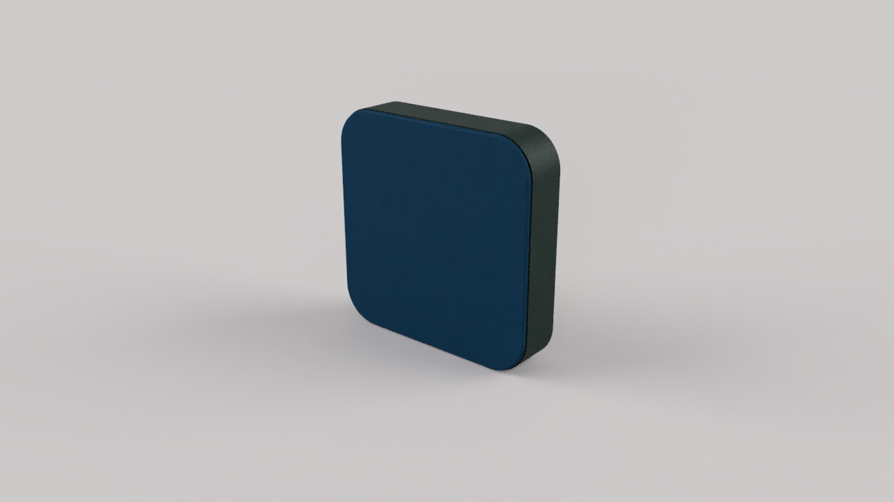

#########################################
An Open Source Wireless Streaming Speaker
#########################################

The *Strøm* open source speaker project have been started with the main goal of creating a fully functional "streaming speaker", but as an open sourced product. One that you can choose to buy fully built and tested, or choose to built it yourself.

   Strøm speaker in conifer linoleum and blue fabric on the soft top.

The primary features of the *Strøm* speaker are:

* Minimalistic design language
* Playback via Spotify Connect and Bluetooth
* Wall mountable
* Sustainable materials

Making it a modern, minimalistic and fully capable speaker.

.. toctree::
   :maxdepth: 2

   guides/index
   software/index
   speaker/index
   requirements
   todo
