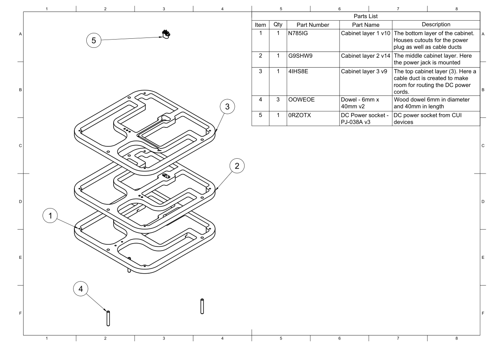

.. _main cabinet assembly:

Assembling the main cabinet
***************************

The main cabinet is assembled using the following 5 parts:

* `Cabinet Layer 1 <cabinet layer 1>`_
* `Cabinet Layer 2 <cabinet layer 2>`_
* `Cabinet Layer 3 <cabinet layer 3>`_
* `Dowels <dowels>`_
* `DC Power socket <Power connector>`_

Each of the three cabinet layers are glued together using standard indoor wood glue. To easily lineup the individual layers with each other, a set (3) of guide holes are bored in each layer. These are for the dowels.

  Exploded view of all the parts needed to assemble the main cabinet.

Following the steps below to assemble the main cabinet.

1. Start with layer 1 and place it, so the cable ducts and layer numbering faces downwards

2. Add wood glue to the guide holes and mount the dowels inside them. Make sure that go all the way through, but do not pertrude further than the face of this layer - otherwise the back panel can't be mounted correctly.

3. Now we are ready to add the second layer.

   a. Apply glue to layer 1 in order to the second layer to adhere to it.

   b. Now take layer two and ensure that the layer identification holes faces up.

   c. Add glue to the guiding holes and place it over the dowels and press down. Make sure to press the layer all the way down so it mates with layer 1.

4. The third layer can now be mounted. This is done in the same way as in point **3** above.

5. Clamp all the layers firmly together and let the glue set.

6. Finally we can mount the DC power socket. This is down with a couple of screw.

    a. Add some hot glue over the wires, to ensure they do not come off. We are encapsulating this socket inside the cabinet, so we do not want any faults.

    b. Place the wire harness in the cable duct and secure it with hut glue.

The main cabinet are now ready for the next stage: :ref:`mounting the baffle <mounting the baffle>`.

Assembly video
--------------

To make it more clear how all these parts comes together, a short video showing an exploded view of the speaker can be found below.
This highlights how all the parts fit together with each other.

.. youtube:: -KRVnBKZZOo

Downloads
---------

Download the drawing as a PDF :download:`main-cabinet-assembly.pdf <main-cabinet/main-cabinet-assembly.pdf>`.
