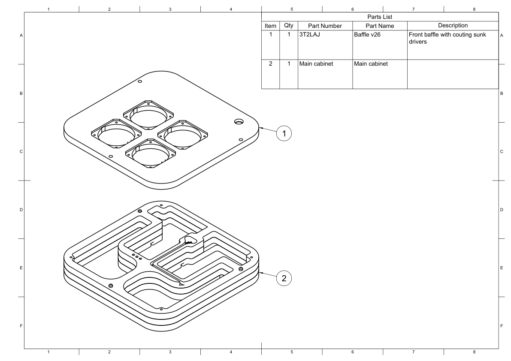

.. _mounting the baffle:

Mounting the baffle
*******************
The baffle and the main cabinet are now ready to be mated.

* `Baffle <cabinet baffle>`_
* `Main cabinet assembly <main cabinet assembly>`_

The baffle needs to be mated to the main cabinet. This is a relatively simply process, but first it needs to finished.

  Exploded view of all the parts needed to mount the baffle to the main cabinet.

Following the steps below to mount the baffle to the main cabinet.

1. Start by finishing the top of the baffle - see `parts description <cabinet baffle>`_ for additional details.

2. Add glue to the main cabinet and place the baffle on the main cabinet, using the dowels guide holes for proper placement.

  a. The top of the dowels should pertrude about 6mm out of the main cabinet. Enough to properly align the baffle on the cabinet.

3. Clamp down the parts while the glue sets.

Assembly video
--------------

To make it more clear how all these parts comes together, a short video showing an exploded view of the speaker can be found below.
This highlights how all the parts fit together with each other.

.. youtube:: 6zH1YJoNRr8

Downloads
---------

Download the drawing as a PDF :download:`mounting-the-baffle.pdf <baffle/mounting-the-baffle.pdf>`.
