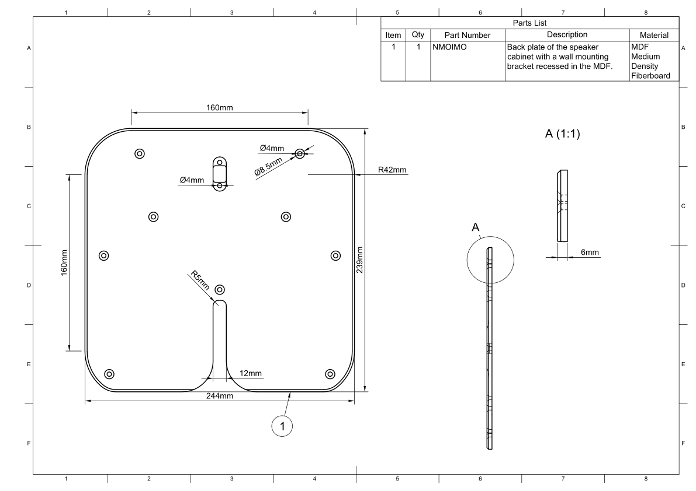

Back Panel
**********

.. sidebar:: Parts information
  :subtitle: See the below for a quick overview of the naming and ID information of this part.

  | **Part name**: *Back Panel*
  | **Parts ID**: SC2GAF
  | **Material**: 6mm, Black MDF

Part description
----------------
The cabinet back panel are the bottom layer in the complete cabinet. This part makes an air tight fit to the rest of the cabinet, sealing the enclosure.

Four counter sunk screw holes -- one in each corner -- are created in this part for easy assembly.

To ensure a close distance between the back panel and the wall, when wall mounted, a bracket needs to be recessed into this part. This bracket must be fastened with two wood screws.

Finish
------
To create a small visual seperation between the wall and the speaker, the back panel must be of a dark color. Preferably black.
The most important part of the back panel to finish with a black tint, are the 45° angled sides.

.. warning::
  Depending on the requirements with regards to MDF degassing, this cabinet part only needs limited finishing, or a full pain job.

Downloads
---------

Download the drawing as a PDF :download:`back-panel-drawing.pdf <back-panel/back-panel-drawing.pdf>`.

Download the CAD file in .STEP format :download:`back-panel.step <back-panel/back-panel.step>`.
