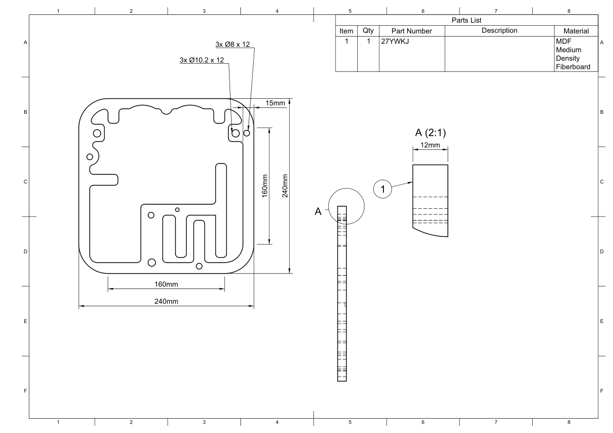

.. _baffle elipse support bottom:

Baffle Elipse Support Bottom
****************************

.. sidebar:: Parts information
  :subtitle: See the below for a quick overview of the naming and ID information of this part.

  | **Part name**: *Baffle Elipse Support Bottom*
  | **Parts ID**: J7NH38
  | **Material**: 12mm, MDF

Part description
----------------

This part helps support the baffle and stiffen the cabinet.
As the drivers are very close together the baffle becomes rather thin and will therefore benefit from being reenforced.

It is also used to ensure proper fixation of the wall mounting bracket.

This part is needed in a sub assembly.

Finish
------
This part doesn't require any finish.

Downloads
---------

Download the drawing as a PDF :download:`cabinet-layer-1-drawing.pdf <cabinet-layer-1/cabinet-layer-1-drawing.pdf>`.

Download the CAD file in .STEP format :download:`baffle-elipse-support-bottom.step <../../../../CAD/baffle-elipse-support-bottom.step>`.

.. panels::
    :column: col-lg-12

    Fusion 360 Source Files
    ^^^^^^^^^^^^^^^^^^^^^^^

    *The model is developed in Fusion 360. To access the original Fusion 360 source files, follow the link below.*

    .. link-button:: https://a360.co/3wmIEnS
        :classes: btn-success
        :text: Access source files
