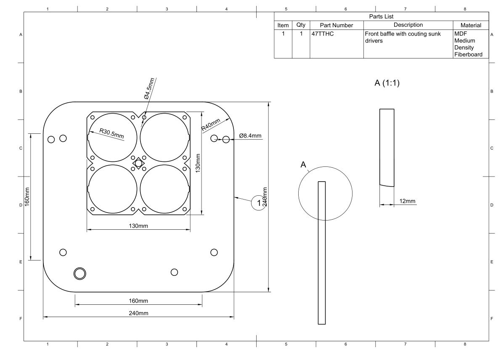

Cabinet Baffle
**************

.. sidebar:: Parts information
  :subtitle: See the below for a quick overview of the naming and ID information of this part.

  | **Part name**: *Baffle*
  | **Parts ID**: 3T2LAJ
  | **Material**: 12mm, MDF

Part description
----------------
The baffle are where the speaker drivers are mounted. They are counting sunk into the baffle, so the top of the driver matches the top of the baffle.
For each driver four screw holes are made to fasten the driver to the baffle.

Three assembly-guiding holes are also cut in to the baffle. This helps aligning the different layers with each other.

.. seealso::
  For further details about the assembly, take a closer look at the :ref:`assembly description <Cabinet Assembly Description>`.

.. todo:: Add feature to ensure proper mounting of the :ref:`soft top frame <Soft Top Frame>` to the baffle.

Finish
------
The top of the baffle must be finished with a paint, complementary to the hue of the :ref:`soft top fabric <Soft Top Fabric>`. If the fabric are of a light hue, then a white paint must be applied -- `RAL9010 <https://www.ralcolorchart.com/ral-classic/ral-9010-pure-white>`_ for instance -- and when are darker hue of fabric are used, then a black finish must be applied -- something like `RAL9005 <https://www.ralcolorchart.com/ral-classic/ral-9005-jet-black>`_ will suffice.

The surface finish of the paint are allowed to be a rough and matte finish, as the top of baffle are covered by the soft top fabric under normal operation.

.. warning::
  Depending on the requirements with regards to MDF degassing, this cabinet part only needs limited finishing, or a full pain job.

Downloads
---------

Download the drawing as a PDF :download:`baffle-drawing.pdf <baffle/baffle-drawing.pdf>`.

Download the CAD file in .STEP format :download:`baffle.step <baffle/baffle.step>`.
