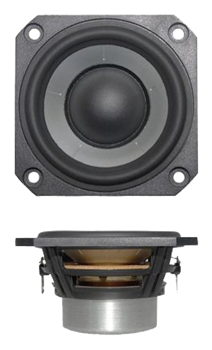

.. _full-range-driver:

Full Range Driver
*****************

.. warning:: This is a required part!

  The driver, the cabinet and the amplifier are all tuned together. Changing one, changes the tuning and thereby the sound and acoustical performance.
  This means that a different make and/or model driver can't be used in this speaker.

.. sidebar:: Parts information
  :subtitle: See the below for a quick overview of the naming and ID information of this part.

  | **Part name**: *Driver; SB65WBAC25-4*
  | **Manufactor**: `SB Audience <http://www.sbaudience.com>`_
  | **Parts ID**: 7SQ7QH
  | **Product link**: `SB Audience SB65WBAC25-4 <http://www.sbaudience.com/index.php/products/various-drivers/sb65wbac25-4/>`_

Parts Description
-----------------
This is the full range driver used in this project. For each speaker a total of four drivers are needed.

These drivers are primarily chosen for their extremely small height -- of only 38mm overall height -- and for their relative high power handling of 20W.

Sourcing
--------
.. todo:: sourcing of this module are still TBD.

Downloads
---------
Download the driver specification as a PDF :download:`2.5in SB65WBAC25-4.pdf <driver/2.5in SB65WBAC25-4.pdf>`.
