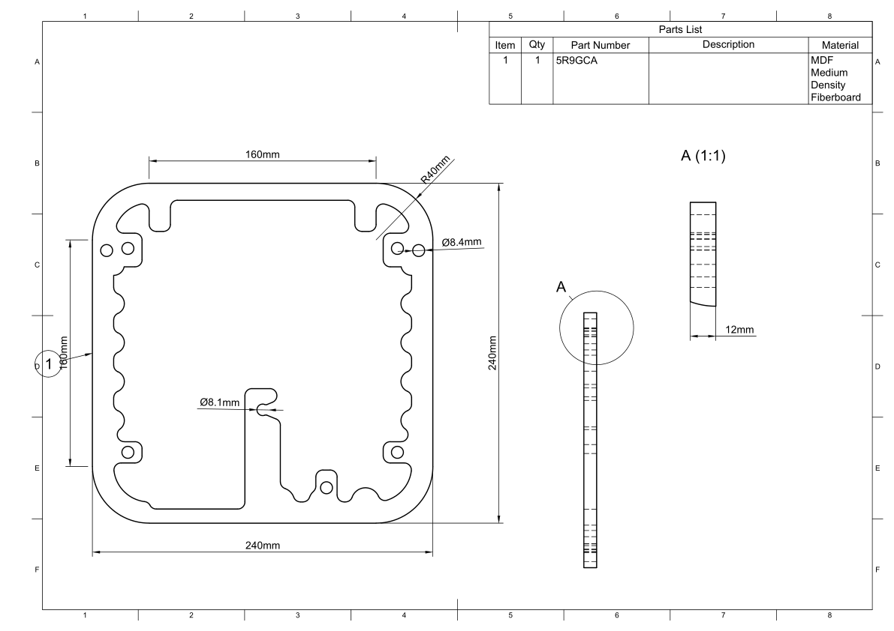

.. _cabinet layer 1:

Cabinet Layer 1
***************

.. sidebar:: Parts information
  :subtitle: See the below for a quick overview of the naming and ID information of this part.

  | **Part name**: *Cabinet layer 1*
  | **Parts ID**: 27YWKJ
  | **Material**: 12mm, MDF

Part description
----------------

This is the first layer of the cabinet, connecting directly to the baffle.
To make room for the DC barrel power plug and it's wires, a mounting hole and a tapering slot are cut. This helps guide the DC power cables from the DC socket.

In the middle of the part a single circle is cutout to indicate the layer number. One circle equals layer 1.

The three larger holes (Ø8,5mm) are for dowels, used for aligning the three layers during cabinet assembly.

Finish
------

This part doesn't require any finish.

Downloads
---------

Download the drawing as a PDF :download:`cabinet-layer-1-drawing.pdf <cabinet-layer-1/cabinet-layer-1-drawing.pdf>`.

Download the CAD file in .STEP format :download:`cabinet-layer-1.step <../../../../CAD/cabinet-layer-1.step>`.

.. panels::
    :column: col-lg-12

    Fusion 360 Source Files
    ^^^^^^^^^^^^^^^^^^^^^^^

    *The model is developed in Fusion 360. To access the original Fusion 360 source files, follow the link below.*

    .. link-button:: https://a360.co/3wpDXcN
        :classes: btn-success
        :text: Access source files
