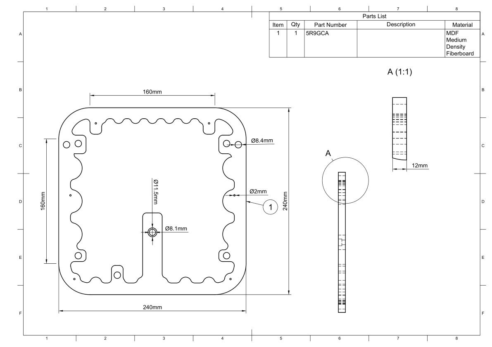

.. _cabinet layer 2:

Cabinet Layer 2
***************

.. sidebar:: Parts information
  :subtitle: See the below for a quick overview of the naming and ID information of this part.

  | **Part name**: *Cabinet layer 1*
  | **Parts ID**: G9SHW9
  | **Material**: 12mm, MDF

Part description
----------------
This is the middle layer of the cabinet. To make room for the DC barrel power socket, a matching slot is cutout. this is done so the socket is counter sunk into the materiel.

In the middle of the part a couple of circles are cutout to indicate the layer number. Two circles equals layer 2.

The four small holes (Ø3,5mm) -- one in each corner -- are used when mounting the back plate to the main cabinet. Depending on the length on the screws used when mounting the back panel, these holes need to be bored.
The three larger holes (Ø6mm) are using for aligning the three layers during cabinet assembly.

Finish
------
This part doesn't require any finish.

Downloads
---------

Download the drawing as a PDF :download:`cabinet-layer-2-drawing.pdf <cabinet-layer-2/cabinet-layer-2-drawing.pdf>`.

Download the CAD file in .STEP format :download:`cabinet-layer-2.step <../../../../CAD/cabinet-layer-2.step>`.

.. panels::
    :column: col-lg-12

    Fusion 360 Source Files
    ^^^^^^^^^^^^^^^^^^^^^^^

    *The model is developed in Fusion 360. To access the original Fusion 360 source files, follow the link below.*

    .. link-button:: https://a360.co/3Fishtr
        :classes: btn-success
        :text: Access source files
