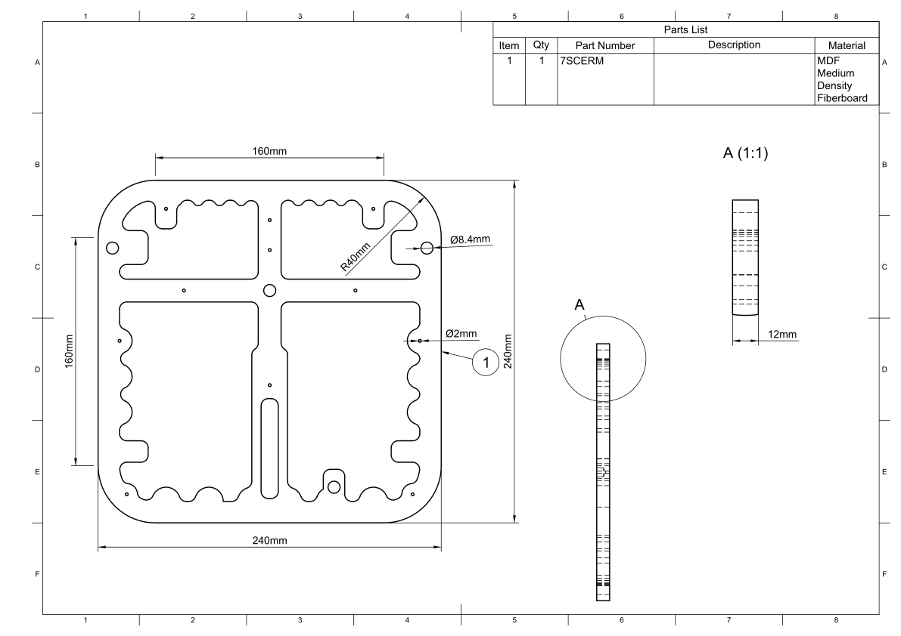

.. _cabinet layer 3:

Cabinet Layer 3
***************

.. sidebar:: Parts information
  :subtitle: See the below for a quick overview of the naming and ID information of this part.

  | **Part name**: *Cabinet layer 1*
  | **Parts ID**: 7SCERM
  | **Material**: 12mm, MDF

Part description
----------------

This is the third layer of the cabinet - counting form the baffle. Here a large keyhole slot a cut to make room for the DC jack, an L-bracket adaptor and a little wire. All in all to make sure that the power connections are consealed when mounted to a wall.

The small holes (Ø2mm) are used when mounting the back plate to the main cabinet.
The larger holes (Ø8,4mm) are for dowels, used for aligning the three layers during cabinet assembly.

Finish
------

This part doesn't require any finish.

Downloads
---------

Download the drawing as a PDF :download:`cabinet-layer-3-drawing.pdf <cabinet-layer-3/cabinet-layer-3-drawing.pdf>`.

Download the CAD file in .STEP format :download:`cabinet-layer-3.step <../../../../CAD/cabinet-layer-3.step>`.

.. panels::
    :column: col-lg-12

    Fusion 360 Source Files
    ^^^^^^^^^^^^^^^^^^^^^^^

    *The model is developed in Fusion 360. To access the original Fusion 360 source files, follow the link below.*

    .. link-button:: https://a360.co/3c8Ejg5
        :classes: btn-success
        :text: Access source files
