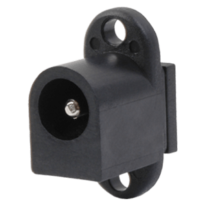

.. _Power connector:

DC Power Socket
***************

.. sidebar:: Parts information
  :subtitle: See the below for a quick overview of the naming and ID information of this part.

  | **Part name**: *DC power socket*
  | **Parts ID**: 0RZOTX
  | **Manufactor**: `CUI Devices <https://www.cuidevices.com>`_
  | **Manufactor ID**: PJ-038A
  | **Product link**: `CUI Devices PJ-038A <https://www.cuidevices.com/product/interconnect/connectors/dc-power-connectors/jacks/pj-038a>`_

Parts Description
-----------------
The DC power socket used are a panel mountable model. This is embedded and counter sunk inside the cabinet, to allow for a concealed power connection.

How this socket are integrated in the cabinet are described in detail in the :ref:`assembly description <Cabinet Assembly Description>` as well as in the description of layer :ref:`2 <cabinet layer 2>` and :ref:`3 <cabinet layer 3>`.

Sourcing
--------
.. todo:: sourcing of this module are still TBD.

Downloads
---------
Download the specification as a PDF :download:`PJ-038A.pdf <power-socket/pj-038a.pdf>`.

Download the CAD file in .STEP format :download:`CUI_DEVICES_PJ-038A.step <power-socket/CUI_DEVICES_PJ-038A.step>`.
