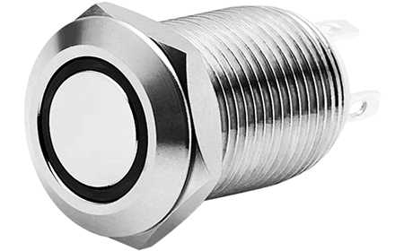
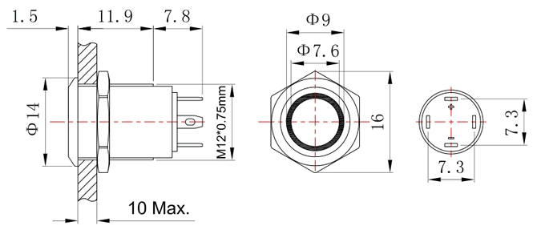

Push Bottom
***********

.. sidebar:: Parts information
  :subtitle: See the below for a quick overview of the naming and ID information of this part.

  | **Part name**: *Push bottom*
  | **Parts ID**: PTRCO9
  | **Manufactor**: `Funeton <http://www.funeton.com>`_
  | **Manufactor ID**: FT12Q-D21
  | **Product link**: `Momentary push button <http://www.funeton.com/product.asp?id=2490>`_

Parts Description
-----------------
A push button is needed when interacting with the speaker directly. This is a momentary push button with an integrated LED ring (green).

There's sadly no specification available as a PDF, but the below diagram will also suffice.

.. todo::
  This LED will likely be used for user feedback, but is currently TBD.

Downloads
---------
Currently no downloads are available.
