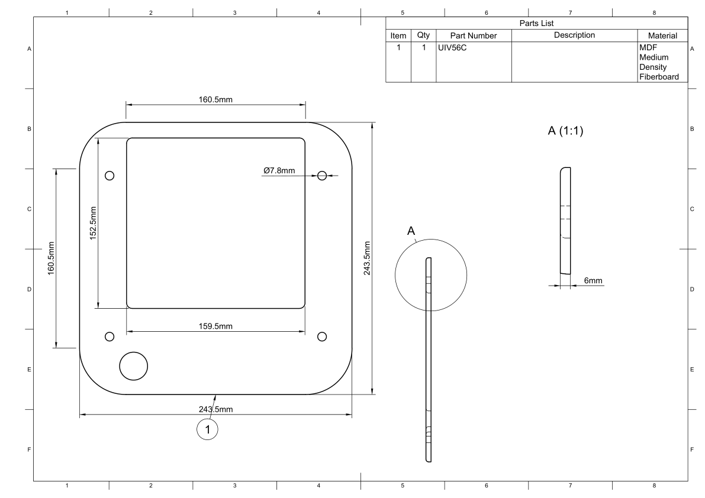

.. _Soft Top Frame:

Soft Top Frame
**************

.. sidebar:: Parts information
  :subtitle: See the below for a quick overview of the naming and ID information of this part.

  | **Part name**: *Soft top frame*
  | **Parts ID**: UIV56C
  | **Material**: 6mm, MDF

Part description
----------------

The soft top frame holds the fabric that covers the drivers. This is a simple part.
The soft top frame are friction fit to the pretuding dowels in hte baffle of the main cabinet. This ensures a tight fit of the frame but at the same time allow for its removal in case of service or repair.

Finish
------
This part is painted black to match the shadow created where the drivers are located.
It is important to lightly sand this part after painting, as the raised grain can in fact tare any fragile fabric.

Downloads
---------

Download the drawing as a PDF :download:`softtop-drawing.pdf <softtop/softtop-drawing.pdf>`.

Download the CAD file in .STEP format :download:`softtop.step <../../../../CAD/softtop.step>`.

  .. panels::
      :column: col-lg-12

      Fusion 360 Source Files
      ^^^^^^^^^^^^^^^^^^^^^^^

      *The model is developed in Fusion 360. To access the original Fusion 360 source files, follow the link below.*

      .. link-button:: https://a360.co/3OXEYPO
          :classes: btn-success
          :text: Access source files
